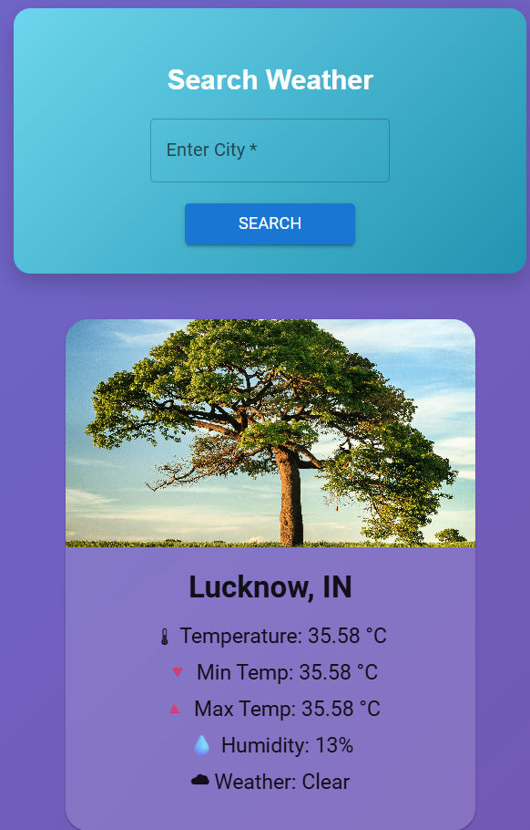

# 🌤️ Weather App - Real-Time Weather Detection

<p align="center">
  
  
  
  
</p>

---

## 📌 Project Overview

A modern, responsive **Weather Application** built with cutting-edge web technologies. This application provides real-time weather information for cities around the world, featuring a clean and intuitive user interface that delivers an exceptional user experience.

### ✨ Key Features

- 🔍 **City Search** - Instantly search weather for any city worldwide
- 🌡️ **Real-Time Data** - Get current temperature, humidity, and weather conditions
- 📊 **Weather Details** - Display minimum, maximum, and current temperatures
- 🎨 **Modern UI** - Clean and professional interface using Material UI
- 📱 **Responsive Design** - Works seamlessly on desktop and mobile devices

---

## 🛠️ Technologies Used

| Technology | Purpose |
|-------------|---------|
| **React 19** | Frontend library for building user interfaces |
| **TypeScript** | Type-safe JavaScript for better developer experience |
| **Vite** | Next-generation frontend tooling |
| **Material UI** | Comprehensive UI component library |
| **ESLint** | Code linting for maintaining quality |

---

## 📸 Project Preview

### Application Screenshot



---

## 🚀 Getting Started

### Prerequisites

Before running this project, ensure you have the following installed:

- **Node.js** (v18 or higher)
- **npm** or **yarn**

### Installation

1. **Clone the repository**
   ```bash
   git clone https://github.com/your-username/mini_project_react.git
   ```

2. **Navigate to the project directory**
   ```bash
   cd mini_project_react
   ```

3. **Install dependencies**
   ```bash
   npm install
   ```

### Running the Application

4. **Start the development server**
   ```bash
   npm run dev
   ```

5. **Open your browser**
   Navigate to `http://localhost:5173` to view the application.

### Building for Production

6. **Create production build**
   ```bash
   npm run build
   ```

7. **Preview production build**
   ```bash
   npm run preview
   ```

---

## 📁 Project Structure

```
mini_project_react/
├── public/                  # Static assets
├── src/
│   ├── assets/             # Images and media
│   ├── App.css             # Main application styles
│   ├── App.tsx             # Main application component
│   ├── InfoBox.tsx         # Weather information display
│   ├── InfoBox.css         # InfoBox styles
│   ├── main.tsx            # Application entry point
│   ├── materialUi.jsx      # Material UI configuration
│   ├── SearchBox.tsx       # City search component
│   ├── SearchBox.css       # SearchBox styles
│   ├── WeatherApp.tsx      # Main weather application
│   └── index.css           # Global styles
├── index.html              # HTML template
├── package.json            # Project dependencies
├── vite.config.ts          # Vite configuration
└── tsconfig.json           # TypeScript configuration
```

---

## 🎯 Usage Guide

1. **Search for a City**: Enter the name of any city in the search box
2. **View Weather Data**: The application displays:
   - Current temperature
   - Minimum and maximum temperatures
   - Humidity percentage
   - Weather condition (sunny, cloudy, rainy, etc.)
3. **Real-Time Updates**: Weather data is fetched in real-time

---

## 🤝 Contributing

Contributions are welcome! Please feel free to submit a Pull Request.

---

## 📄 License

This project is licensed under the MIT License.

---

## 👨‍💻 Developer

**Your Name Here**

- GitHub: [sanjana012s]
- Email: [sanjana081220@gmail.com]

---

<p align="center">
  <strong>⭐ Star this repository if you found it helpful!</strong>
</p>

<p align="center">
  Built with ❤️ using React, TypeScript, and Material UI
</p>

